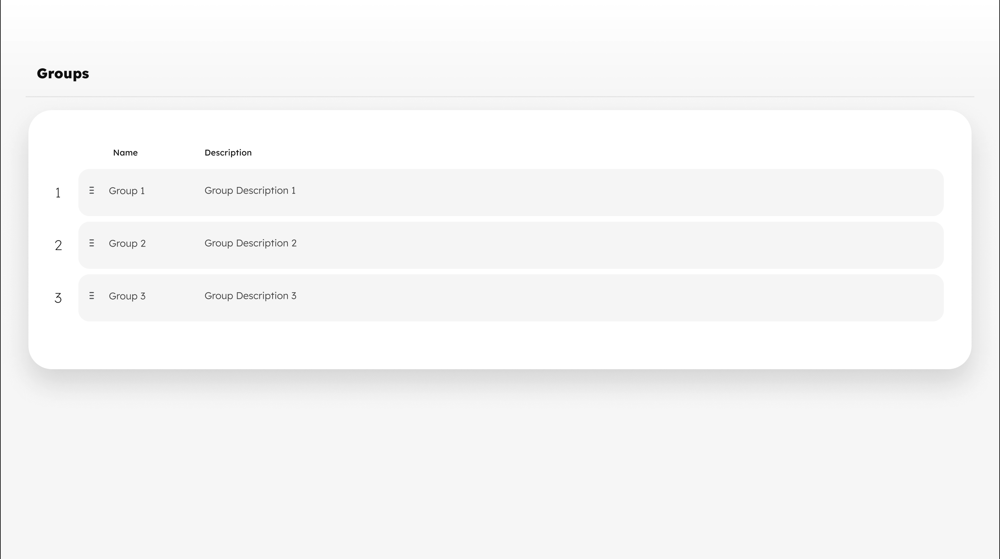

# Frontend Engineer – Home Assignment

## Installation

```bash
npm install
```

## Usage

```bash
npm start
```

Navigate to `http://localhost:3000/`. The app will automatically reload if you change any of the source files as it uses vite.

## Objective and Assignment Explanation:

In this assignment, you will build a web application to manage "Group" entities using React
and Tailwind CSS. A Group is an entity that holds shipments based on specific criteria. Each
Group has properties including a priority. The application should allow users to create, view,
and manage these Groups.
As part of the assignment, you should follow this Figma design:


## Application Overview

The application should be a professional, responsive web application that allows users to
efficiently manage Groups. The key features include:

1. List of Groups:

- Display a list of existing Groups.
- Each row in the table should be draggable to reorder the Groups based on their
  priority.
- Columns should include Name, Description, and Priority.

2. Create New Group:

- Provide a form to create a new Group.
- The form should include fields for all properties: Name, Description, and Priority.
- New Groups should be assigned the lowest priority and be positioned last in the
  Groups list.
- Implement validation for required fields and proper formats.

3. View Group Details:

- Create a screen to view detailed information about a Group.
- This screen should display all properties of the Group in a readable format.
- There is no need to implement an 'edit Group' screen.

4. Priority:

- Each Group entity should have a priority property that defines its location in the
  Group list.
- Ensure the drag-and-drop functionality accurately updates the priority of each
  Group based on its new position.

Technical Requirements

- Use React for building the UI components.
- Style the application using Tailwind CSS.

Sensoslabz.io | Proprietary & Confidential 1

- Data should be stored in local storage.
- Ensure the application is responsive and works well on different screen sizes.
- Use TypeScript for type safety.
- Implement drag-and-drop functionality.
- You can use UI component libraries such as Material UI or Radix UI to enhance the
  user interface.

## Submission Guidelines

- Provide a link to a public repository (e.g., GitHub) containing the code.
- Include a README file with setup instructions and any other relevant information.
- Ensure the application can be run locally with minimal setup.

Feel free to reach out if you have any questions or need further
